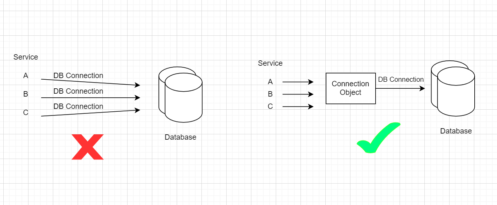

# Singleton Design Pattern
- Allows us to create a class for which ```single``` object can be created.
- This is useful when exactly one object is needed to coordinate actions across the system.


### Why ?

#### Shared resource: 
- Imagine you have a class that is responsible for managing database connection. You want to make sure that only once instance of this class exists in your application.
If you create multiple instances of this class, you will end up with multiple database connections, which is not what you want.

- A class which is having shared resources is expensive

Eg:-
  ```java
  class Service{
    Database db;
  }
  
  
  class Database {
    private String url;
    private String passward;
    private List<TCPConeection> tcpConections;
    
    public changeURL(){
        
    }
  }
   ```
- Establishing TCP Connection is very expensive.



- Similarly, there can be a class that is responsible for managing ths logging mechanism. You want to make sure that only one instance of this class exists in your application. If you create multiple instances of this class, you will end up with multiple log files, which is not what you want.
- When using logger we might be writing to many files. Opening many files by multiple threads be very expensive.

```If Object creation is costly then Singleton Design Pattern is used```

- Let say You have 

```
class CreateUserService {
    db.save(User x)
}
``` 
and fetch user service
```
class FetchUserService{
    db.changeURL(B) - not allowed
    db.get(User x)
}
```
- There is a chance that some can change anything, so, we shouldn't allow this.
- Singleton design is ```Immutable``` . Once Object created, you cannot change its internal property.
#### Single access point:
-   Applications often require configurations. For example you might want to configure database connection parameters. You want to make sure that only once instance of this class exists in your application.
- A configuration class should have a single access point to the configuration parameters. If you create multiple instances of this class, you will end up with multiple configuration file.


### Solution:

Singleton pattern is creational design pattern that lets you ensure that a class has only one instance, while providing a global access point to this instance. To implement this Singleton pattern, the following steps are required

### Steps to implement:

```java
class DatabaseConn{
   private String url;
   private String password;
   private List<TcpConnection> tcpConnections;
}
```

Lets create objects

```java
DatabaseConn db1 = new DatabaseConn();
DatabaseConn db2 = new DatabaseConn();
```

Is someone stopping you to create multiple objects ? ```No```

- Till the Constructor are available then any one can create objects of class.
- To restrict the object creation, we should make Constructor as ```private```

```java
DatabaseConn{
    private String url;
    private String password;
    private List<TcpConnection> tcpConnections;
    
    private DatabaseConn(){
        
    }
}
```

- Because Constructor is ```private``` we can't create even ```single``` object.

Then who can create object ? ```same class itself```

- so we should create a ```static``` method so that we can access without creating object and return ```object``` from that method.

```java
DatabaseConn{
    private String url;
    private String password;
    private List<TcpConnection> tcpConnections;
    
    private DatabaseConn(){
    }
    
    public static  DatabaseConn getInstance(){
        return new DatabaseConn();
    }
}
```

```java
DatabaseConn db1 = new DatabaseConn();
DatabaseConn db2 = new DatabaseConn();
```

Still any one stopping to create multiple objects ? ```No```

Then how to solve it ?

```java
DatabaseConn{
    private static DatabaseConn instance = null;
    
    private String url;
    private String password;
    private List<TcpConnection> tcpConnections;
    
    private DatabaseConn(){
    }
    
    public static  DatabaseConn getInstance(){
        if(instance == null){
            instance = new DatabaseConn();
        }
        
        return instance;
    }
}
```

